# Porno Bot Проект

## Миграции

1. Создание миграции:
```shell
alembic revision --autogenerate -m "Migration Comment"
```
2. Применить миграции
```shell
alembic upgrade head
```

### Зависимости:
```
aiogram==3.4.1
alembic==1.13.1
asyncpg==0.29.0
black==24.4.0
loguru==0.7.2
psycopg2-binary==2.9.9
pydantic==2.5.3
pydantic-settings==2.2.1
SQLAlchemy==2.0.29
```

## Фото
Админка            |  Пользователь
:-------------------------:|:-------------------------
  |  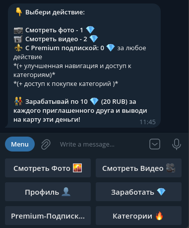
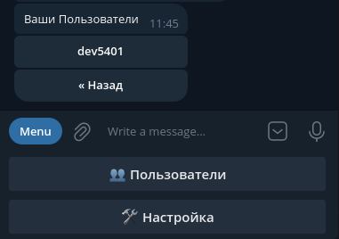  |  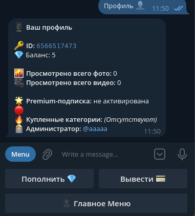
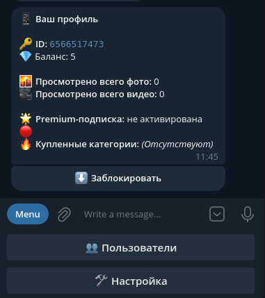  |  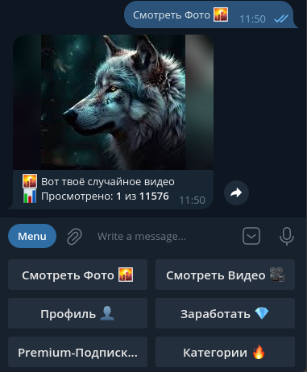
  |  
  |  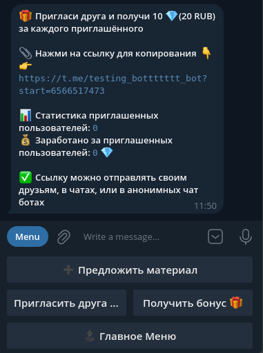
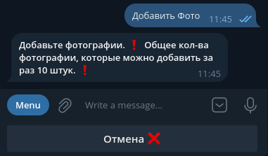  |  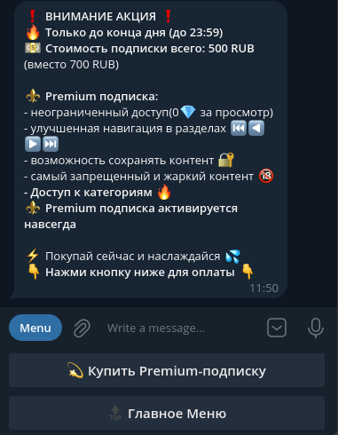
  |  
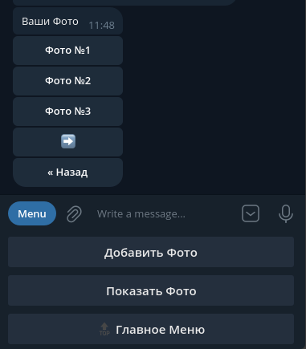  |  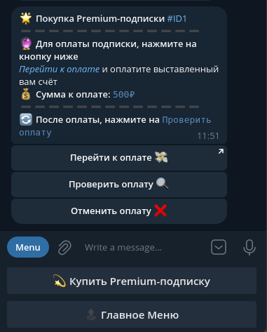
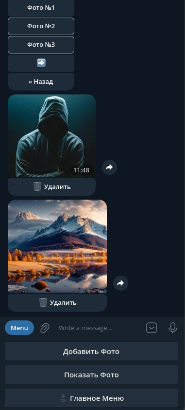  |  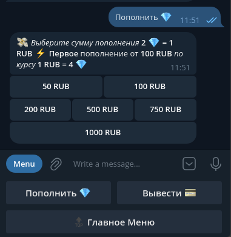
  |  
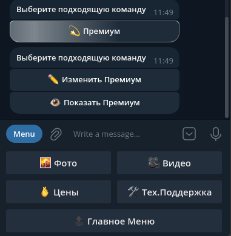  |  